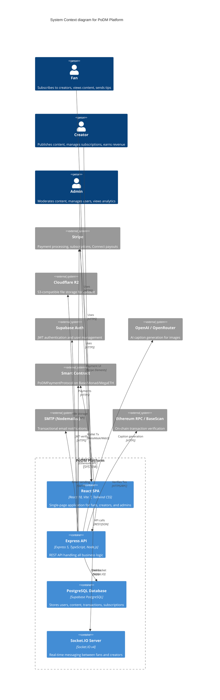

# System Architecture — C4 Container Diagram

> Phase 7 — Diagram Generation
> Generated: 2026-07-02

```mermaid
C4Context
  title System Context diagram for PoDM Platform

  Person(fan, "Fan", "Subscribes to creators, views content, sends tips")
  Person(creator, "Creator", "Publishes content, manages subscriptions, earns revenue")
  Person(admin, "Admin", "Moderates content, manages users, views analytics")

  System_Boundary(podm, "PoDM Platform") {
    Container(webapp, "React SPA", "React 18, Vite 7, Tailwind CSS", "Single-page application for fans, creators, and admins")
    Container(api, "Express API", "Express 5, TypeScript, Node.js", "REST API handling all business logic")
    Container(db, "PostgreSQL Database", "Supabase PostgreSQL", "Stores users, content, transactions, subscriptions")
    Container(ws, "Socket.IO Server", "Socket.IO v4", "Real-time messaging between fans and creators")
  }

  System_Ext(stripe, "Stripe", "Payment processing, subscriptions, Connect payouts")
  System_Ext(r2, "Cloudflare R2", "S3-compatible file storage for content")
  System_Ext(supabase, "Supabase Auth", "JWT authentication and user management")
  System_Ext(openai, "OpenAI / OpenRouter", "AI caption generation for images")
  System_Ext(contract, "Smart Contract", "PoDMPaymentProtocol on Base/Monad/MegaETH")
  System_Ext(email, "SMTP (Nodemailer)", "Transactional email notifications")
  System_Ext(blockchain, "Ethereum RPC / BaseScan", "On-chain transaction verification")

  Rel(fan, webapp, "Uses", "HTTPS")
  Rel(creator, webapp, "Uses", "HTTPS")
  Rel(admin, webapp, "Uses", "HTTPS")
  Rel(webapp, api, "API calls", "REST/JSON")
  Rel(webapp, ws, "WebSocket", "Socket.IO")
  Rel(api, db, "Queries", "SQL")
  Rel(api, supabase, "JWT verify", "HTTPS")
  Rel(api, stripe, "Payments", "HTTPS")
  Rel(api, r2, "File storage", "S3 API")
  Rel(api, openai, "Caption generation", "HTTPS")
  Rel(api, email, "Email sending", "SMTP")
  Rel(api, contract, "Submits Txs", "Ethereum RPC")
  Rel(api, blockchain, "Verifies Txs", "HTTPS/RPC")
  Rel(webapp, stripe, "Payment UI", "Stripe Elements")
  Rel(webapp, contract, "Wallet Tx", "MetaMask/Web3")
```
