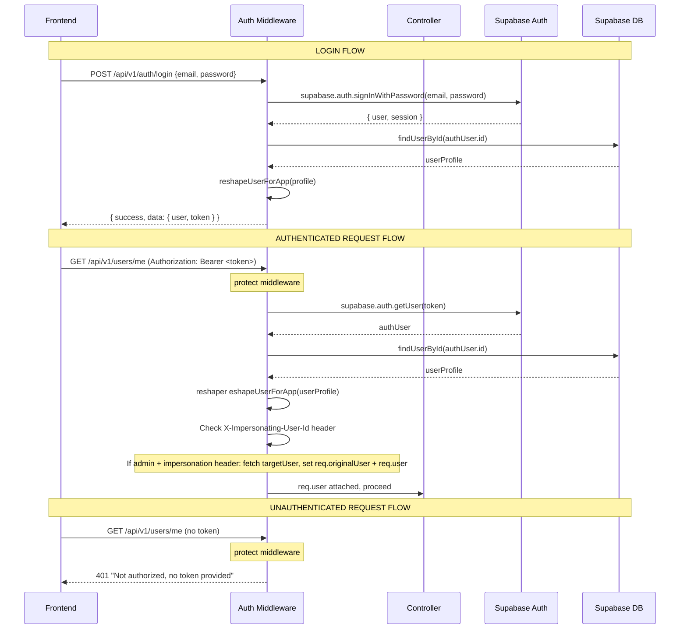

# Authentication Sequence

> Phase 7 — Diagram Generation
> Generated: 2026-07-02

```mermaid
sequenceDiagram
  participant F as Frontend
  participant A as Auth Middleware
  participant C as Controller
  participant S as Supabase Auth
  participant D as Supabase DB

  Note over F,D: LOGIN FLOW

  F->>A: POST /api/v1/auth/login {email, password}
  A->>S: supabase.auth.signInWithPassword(email, password)
  S-->>A: { user, session }
  A->>D: findUserById(authUser.id)
  D-->>A: userProfile
  A->>A: reshapeUserForApp(profile)
  A-->>F: { success, data: { user, token } }

  Note over F,D: AUTHENTICATED REQUEST FLOW

  F->>A: GET /api/v1/users/me (Authorization: Bearer <token>)
  Note over A: protect middleware
  A->>S: supabase.auth.getUser(token)
  S-->>A: authUser
  A->>D: findUserById(authUser.id)
  D-->>A: userProfile
  A->>A: reshaper eshapeUserForApp(userProfile)
  A->>A: Check X-Impersonating-User-Id header
  Note over A: If admin + impersonation header: fetch targetUser, set req.originalUser + req.user
  A->>C: req.user attached, proceed

  Note over F,D: UNAUTHENTICATED REQUEST FLOW

  F->>A: GET /api/v1/users/me (no token)
  Note over A: protect middleware
  A-->>F: 401 "Not authorized, no token provided"
```
