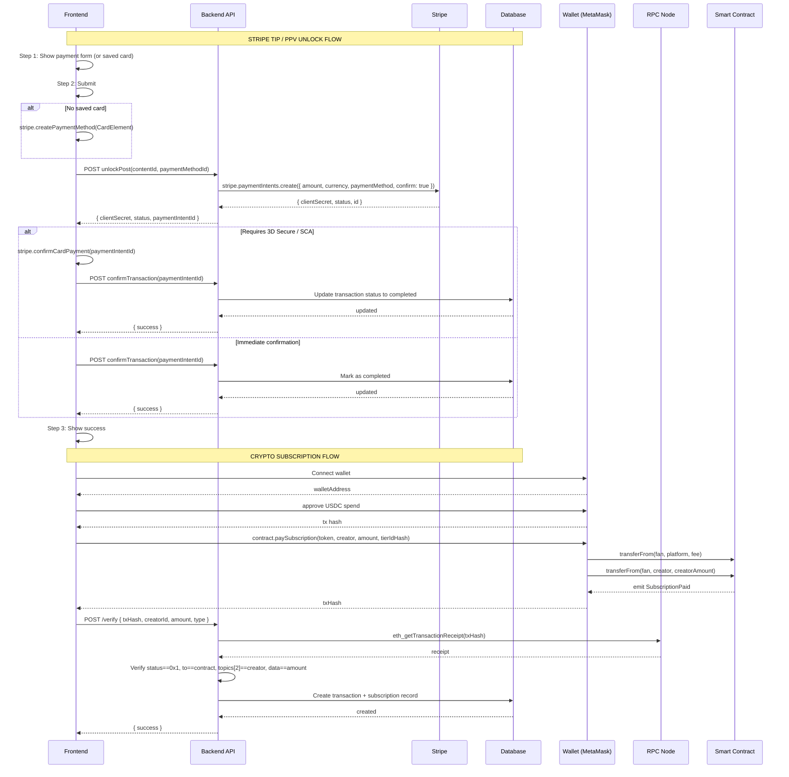

# Payment Processing Flow

> Phase 7 — Diagram Generation
> Generated: 2026-07-02

> **See also:** `docs/flowcharts/009-c04-tipping-and-ppv-payment-flow.md` — crypto path (USDC smart contract) for parallel payment method.
