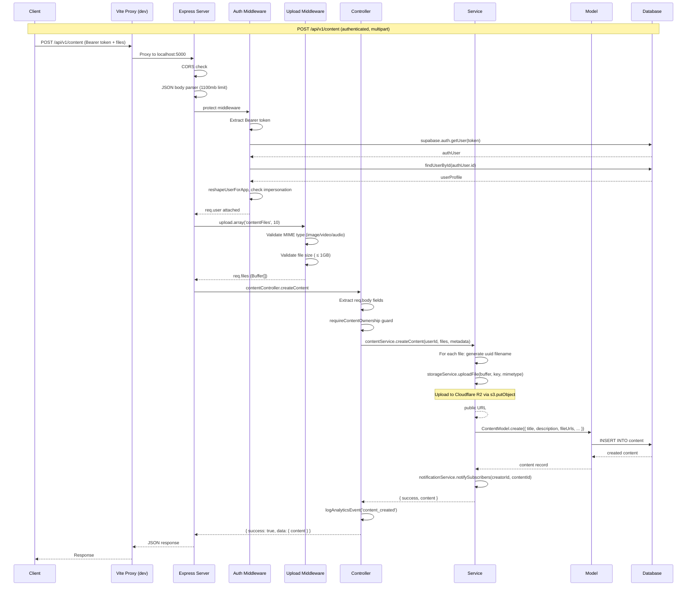

# Request Lifecycle — Route to Database

> Phase 7 — Diagram Generation
> Generated: 2026-07-02

```mermaid
sequenceDiagram
  participant C as Client
  participant V as Vite Proxy (dev)
  participant S as Express Server
  participant A as Auth Middleware
  participant U as Upload Middleware
  participant CT as Controller
  participant SV as Service
  participant M as Model
  participant D as Database

  Note over C,D: POST /api/v1/content (authenticated, multipart)

  C->>V: POST /api/v1/content (Bearer token + files)
  V->>S: Proxy to localhost:5000
  S->>S: CORS check
  S->>S: JSON body parser (1100mb limit)

  S->>A: protect middleware
  A->>A: Extract Bearer token
  A->>D: supabase.auth.getUser(token)
  D-->>A: authUser
  A->>D: findUserById(authUser.id)
  D-->>A: userProfile
  A->>A: reshapeUserForApp, check impersonation
  A-->>S: req.user attached

  S->>U: upload.array('contentFiles', 10)
  U->>U: Validate MIME type (image/video/audio)
  U->>U: Validate file size ( ≤ 1GB)
  U-->>S: req.files (Buffer[])

  S->>CT: contentController.createContent

  CT->>CT: Extract req.body fields
  CT->>CT: requireContentOwnership guard

  CT->>SV: contentService.createContent(userId, files, metadata)

  SV->>SV: For each file: generate uuid filename
  SV->>SV: storageService.uploadFile(buffer, key, mimetype)
  Note over SV: Upload to Cloudflare R2 via s3.putObject
  SV-->>SV: public URL

  SV->>M: ContentModel.create({ title, description, fileUrls, ... })
  M->>D: INSERT INTO content
  D-->>M: created content
  M-->>SV: content record

  SV->>SV: notificationService.notifySubscribers(creatorId, contentId)
  SV-->>CT: { success, content }

  CT->>CT: logAnalyticsEvent('content_created')

  CT-->>S: { success: true, data: { content } }
  S-->>V: JSON response
  V-->>C: Response
```
