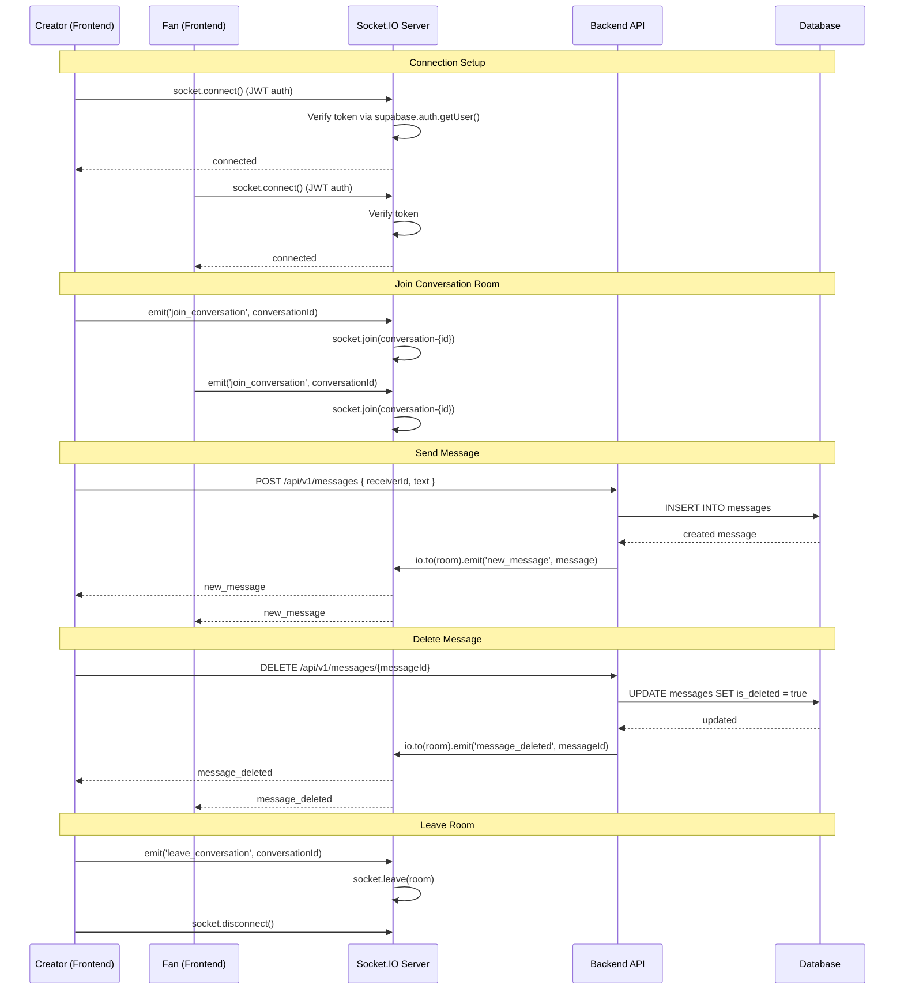

# Real-Time Messaging Architecture

> Phase 7 — Diagram Generation
> Generated: 2026-07-02

```mermaid
sequenceDiagram
  participant C as Creator (Frontend)
  participant F as Fan (Frontend)
  participant S as Socket.IO Server
  participant B as Backend API
  participant D as Database

  Note over C,D: Connection Setup

  C->>S: socket.connect() (JWT auth)
  S->>S: Verify token via supabase.auth.getUser()
  S-->>C: connected

  F->>S: socket.connect() (JWT auth)
  S->>S: Verify token
  S-->>F: connected

  Note over C,D: Join Conversation Room

  C->>S: emit('join_conversation', conversationId)
  S->>S: socket.join(conversation-{id})
  F->>S: emit('join_conversation', conversationId)
  S->>S: socket.join(conversation-{id})

  Note over C,D: Send Message

  C->>B: POST /api/v1/messages { receiverId, text }
  B->>D: INSERT INTO messages
  D-->>B: created message
  B->>S: io.to(room).emit('new_message', message)
  S-->>C: new_message
  S-->>F: new_message

  Note over C,D: Delete Message

  C->>B: DELETE /api/v1/messages/{messageId}
  B->>D: UPDATE messages SET is_deleted = true
  D-->>B: updated
  B->>S: io.to(room).emit('message_deleted', messageId)
  S-->>C: message_deleted
  S-->>F: message_deleted

  Note over C,D: Leave Room

  C->>S: emit('leave_conversation', conversationId)
  S->>S: socket.leave(room)
  C->>S: socket.disconnect()
```
