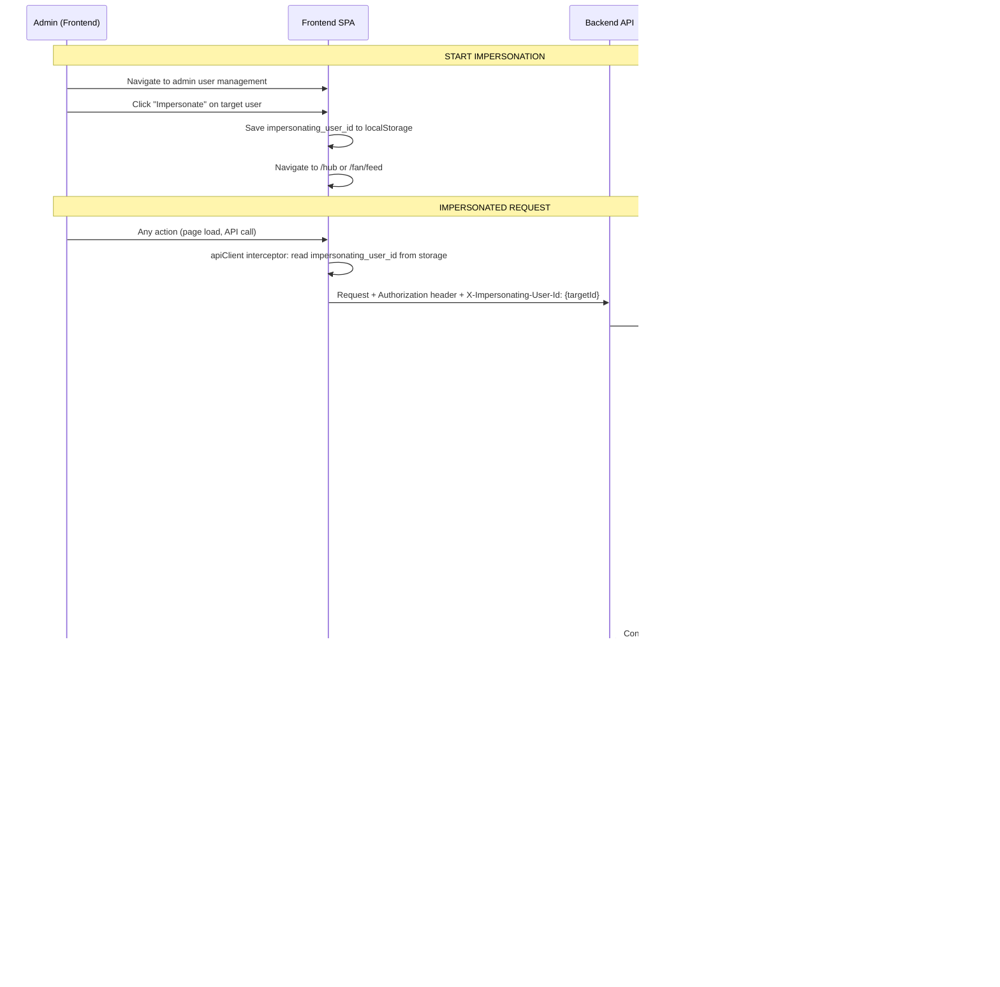

# Admin Impersonation Flow

> Phase 7 — Diagram Generation
> Generated: 2026-07-02

```mermaid
sequenceDiagram
  participant A as Admin (Frontend)
  participant F as Frontend SPA
  participant B as Backend API
  participant M as Auth Middleware
  participant D as Database

  Note over A,D: START IMPERSONATION

  A->>F: Navigate to admin user management
  A->>F: Click "Impersonate" on target user
  F->>F: Save impersonating_user_id to localStorage
  F->>F: Navigate to /hub or /fan/feed

  Note over A,D: IMPERSONATED REQUEST

  A->>F: Any action (page load, API call)
  F->>F: apiClient interceptor: read impersonating_user_id from storage
  F->>B: Request + Authorization header + X-Impersonating-User-Id: {targetId}

  B->>M: protect middleware
  M->>M: Verify admin JWT via supabase.auth.getUser()
  M->>D: findUserById(admin.id)
  D-->>M: admin profile
  M->>M: Detect X-Impersonating-User-Id header
  M->>M: admin.role === 'admin'? → Yes
  M->>D: findUserById(impersonatingUserId)
  D-->>M: targetUser profile
  M->>M: req.originalUser = admin
  M->>M: req.user = reshapedTargetUser
  M-->>B: Continue with impersonated user

  B->>B: All downstream logic sees req.user as target user
  B-->>F: Response as if target user made the request
  F-->>A: UI shows impersonation banner "You are impersonating {name}"

  Note over A,D: STOP IMPERSONATION

  A->>F: Click "Stop Impersonating"
  F->>F: Clear impersonating_user_id from localStorage
  F->>F: Navigate to /admin/dashboard
  F->>B: Subsequent requests: no impersonation header
  B->>M: Normal auth flow
  B-->>F: Response as admin
```
