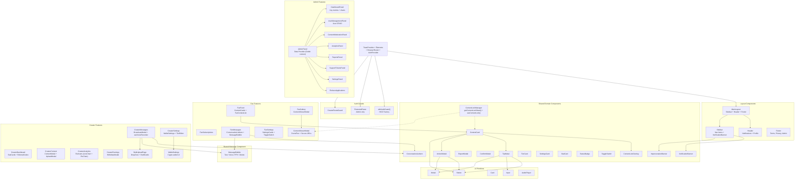

# Frontend Component Tree

> Phase 7 — Diagram Generation
> Generated: 2026-07-02

```mermaid
graph TB
  App["<App><br/>ToastProvider + Elements + BrowserRouter + AuthProvider"]

  subgraph "Layout Components"
    ML["MainLayout<br/>Sidebar + Header + Footer"]
    H["Header<br/>Notifications + Profile"]
    S["Sidebar<br/>Nav items + VerificationBanner"]
    F["Footer<br/>Terms, Privacy, Admin"]
  end

  subgraph "UI Primitives"
    BT["Button"]
    IN["Input"]
    CD["Card"]
    MD["Modal"]
    AP["AudioPlayer"]
  end

  subgraph "Shared Domain Components"
    CC["ContentCard"]
    CLO["ContentLockOverlay"]
    CLM["ContentLockManager<br/>getContentLockState() + useContentLock()"]
    TM["TipModal"]
    UM["UnlockModal"]
    RM["ReportModal"]
    CM["ConfirmModal"]
    CLI["ConversationListItem"]
    TC["TierCard"]
    SC["SettingsCard"]
    STC["StatCard"]
    SB["StatusBadge"]
    TGS["ToggleSwitch"]
    VB["VerificationBanner"]
    IB["ImpersonationBanner"]
  end

  subgraph "Auth Guards"
    WAG["withAuthGuard()<br/>HOC Factory"]
    PR["ProtectedRoute<br/>Admin only"]
    CRG["CreatorRouteGuard"]
  end

  subgraph "Fan Features"
    FF["FanFeed<br/>ContentCards + FanContestList"]
    FG["FanGallery<br/>ContentViewerModal"]
    FS["FanSubscriptions"]
    FMT["FanMessages<br/>ConversationListItem + MessageBubble"]
    FST["FanSettings<br/>SettingsCards + ToggleSwitch"]
    CVM["ContentViewerModal<br/>Zoom/Pan + Secure URLs"]
  end

  subgraph "Creator Features"
    CDB["CreatorDashboard<br/>StatCards + ReferralCodes"]
    CCT["CreatorContent<br/>ContentModal + UploadModal"]
    CAN["CreatorAnalytics<br/>Recharts (LineChart + PieChart)"]
    CEA["CreatorEarnings<br/>WithdrawModal"]
    CMT["CreatorMessages<br/>BroadcastModal + useVoiceRecorder"]
    CST["CreatorSettings<br/>WalletSettings + TierEditor"]
    BUP["BulkUploadPage<br/>DropZone + DraftCards"]
    WST["WalletSettings<br/>Crypto wallet UI"]
  end

  subgraph "Admin Features"
    APN["AdminPanel<br/>Data Provider (Outlet context)"]
    DP["DashboardPanel<br/>Key metrics + charts"]
    UMP["UserManagementPanel<br/>User CRUD"]
    CMP["ContentModerationPanel"]
    ANP["AnalyticsPanel"]
    RP["ReportsPanel"]
    STP["SupportTicketsPanel"]
    SETP["SettingsPanel"]
    EAP["EnclaveApplications"]
  end

  subgraph "Shared Message Component"
    MB["MessageBubble<br/>Text / Voice / PPV / Delete"]
  end

  App --> ML
  App --> WAG
  App --> PR
  App --> CRG

  ML --> H
  ML --> S
  S --> VB
  S --> IB

  CC --> CLO
  CC --> TM
  CC --> UM
  CC --> BT

  TM --> BT
  TM --> IN
  TM --> MD

  UM --> BT
  UM --> MD

  CLM -.-> CC
  CLM -.-> CVM

  FF --> CC
  FG --> CVM
  FMT --> CLI
  FMT --> MB
  CMT --> CLI
  CMT --> MB

  CST --> WST
  CMT --> BUP

  APN --> DP
  APN --> UMP
  APN --> CMP
  APN --> ANP
  APN --> RP
  APN --> STP
  APN --> SETP
  APN --> EAP
```
