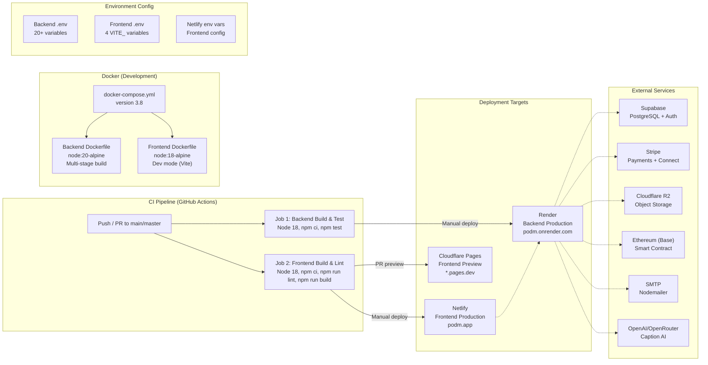

# Deployment & CI/CD Pipeline

> Phase 7 — Diagram Generation
> Generated: 2026-07-02

```mermaid
graph LR
  subgraph "CI Pipeline (GitHub Actions)"
    GIT["Push / PR to main/master"]
    J1["Job 1: Backend Build & Test<br/>Node 18, npm ci, npm test"]
    J2["Job 2: Frontend Build & Lint<br/>Node 18, npm ci, npm run lint, npm run build"]
    GIT --> J1
    GIT --> J2
  end

  subgraph "Deployment Targets"
    NET["Netlify<br/>Frontend Production<br/>podm.app"]
    RND["Render<br/>Backend Production<br/>podm.onrender.com"]
    CFP["Cloudflare Pages<br/>Frontend Preview<br/>*.pages.dev"]
  end

  J2 -->|"Manual deploy"| NET
  J2 -->|"PR preview"| CFP
  J1 -->|"Manual deploy"| RND

  subgraph "Docker (Development)"
    DC["docker-compose.yml<br/>version 3.8"]
    BDD["Backend Dockerfile<br/>node:20-alpine<br/>Multi-stage build"]
    FDD["Frontend Dockerfile<br/>node:18-alpine<br/>Dev mode (Vite)"]
    DC --> BDD
    DC --> FDD
  end

  subgraph "External Services"
    SUPABASE["Supabase<br/>PostgreSQL + Auth"]
    STRIPE["Stripe<br/>Payments + Connect"]
    R2["Cloudflare R2<br/>Object Storage"]
    ETH["Ethereum (Base)<br/>Smart Contract"]
    SMTP["SMTP<br/>Nodemailer"]
    OPENAI["OpenAI/OpenRouter<br/>Caption AI"]
  end

  RND -.-> SUPABASE
  RND -.-> STRIPE
  RND -.-> R2
  RND -.-> ETH
  RND -.-> SMTP
  RND -.-> OPENAI

  NET -.-> RND

  subgraph "Environment Config"
    BE_ENV["Backend .env<br/>20+ variables"]
    FE_ENV["Frontend .env<br/>4 VITE_ variables"]
    NET_ENV["Netlify env vars<br/>Frontend config"]
  end
```
