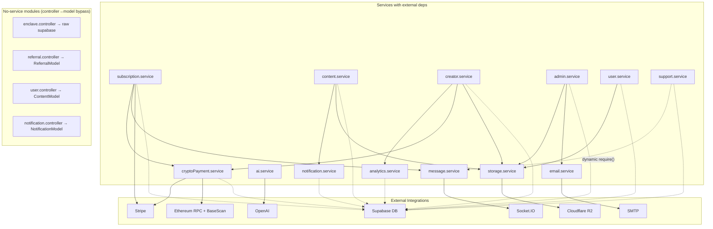

> **Note**: All Stripe references in this document are historical. PoDM uses crypto-only payments (USDC on Base) as of v2.

# Service Dependency Matrix

> Phase 7 — Diagram Generation
> Generated: 2026-07-02

