## A-04: Internal Workflow Dependency Map

Maps how the 28 internal workflows across 6 categories connect to each other and to external boundaries, showing triggering mechanisms: synchronous calls, fire-and-forget (`.catch()`), and Socket.IO events.

```mermaid
flowchart TD
    subgraph Content["Content Workflows"]
        direction TB
        Upload["Upload (R2, 3-retry exp backoff)"]
        Thumbnail["Thumbnail Generation"]
        Watermark["Dynamic Watermarking"]
        ScheduledPub["Scheduled Publish"]
        ContentDel["Content Deletion"]
    end

    subgraph Payment["Payment Workflows"]
        direction TB
        CryptoVerify["Crypto Verify (11-step)"]
        FeeCalc["Fee Calculation (12.5%)"]
        PayoutReq["Payout Request"]
        RefBonus["Referral Bonus"]
    end

    subgraph Messaging["Messaging Workflows"]
        direction TB
        SendMsg["Send Message"]
        MassMsg["Mass Message"]
        TicketDM["Ticket to DM Sync"]
        NotifBroadcast["Notification Broadcast"]
    end

    subgraph AuthWf["Auth Workflows"]
        direction TB
        Login["Login"]
        Signup["Signup + Orphan Cleanup"]
        PwdReset["Password Reset"]
    end

    subgraph AnalyticsWf["Analytics Workflows"]
        direction TB
        EventLog["Event Log"]
        ContentViewInc["Content View Increment"]
        SummaryAgg["Summary Aggregation"]
    end

    subgraph AdminWf["Admin Workflows"]
        direction TB
        DashboardStats["Dashboard Stats"]
        ContentMod["Content Moderation"]
        VerificationDoc["Verification Doc Access"]
    end

    Upload -->|"synchronous"| Thumbnail
    Upload -->|"synchronous"| Watermark
    CryptoVerify -->|"synchronous"| FeeCalc
    FeeCalc -->|"synchronous"| PayoutReq
    RefBonus -.->|"fire-and-forget"| NotifBroadcast
    Signup -.->|"fire-and-forget"| NotifBroadcast
    SendMsg -.->|"Socket.IO"| NotifBroadcast
    MassMsg -.->|"Socket.IO"| NotifBroadcast
    TicketDM -.->|"Socket.IO"| NotifBroadcast
    ContentViewInc -->|"synchronous"| SummaryAgg
    EventLog -.->|"fire-and-forget"| SummaryAgg
    ContentMod -->|"synchronous"| ContentDel
    DashboardStats -->|"synchronous"| SummaryAgg
    ScheduledPub -->|"synchronous"| Upload
    PwdReset -->|"synchronous"| Login
    VerificationDoc -->|"synchronous"| ContentMod

    NoteA["Only 1 of 28 workflows has retry logic - storage.service.ts"]
    style NoteA fill:#f96,stroke:#333,stroke-width:2px,stroke-dasharray: 5 5
```

Groups workflows into 6 categories (Content, Payment, Messaging, Auth, Analytics, Admin) and labels inter-workflow connections by triggering mechanism. Solid arrows represent synchronous calls, dashed arrows represent fire-and-forget or Socket.IO events. The R2 upload workflow in `storage.service.ts` is the only one with 3-retry exponential backoff.
