## A-05: Environment Configuration Map

Maps all 20+ backend environment variables to their configuration files, initialization points, and consuming modules across 7 domains.

```mermaid
flowchart TD
    subgraph Supabase["Supabase"]
        direction TB
        SU["SUPABASE_URL"]
        SR["SUPABASE_SERVICE_ROLE_KEY"]
        SAK["SUPABASE_ANON_KEY"]
    end
    subgraph Stripe["Stripe"]
        direction TB
        SSK["STRIPE_SECRET_KEY"]
        SWS["STRIPE_WEBHOOK_SECRET"]
        NSP["NEXT_PUBLIC_STRIPE_PUBLISHABLE_KEY"]
    end
    subgraph R2["R2 / Cloudflare"]
        direction TB
        RAK["R2_ACCESS_KEY_ID"]
        RSAK["R2_SECRET_ACCESS_KEY"]
        RAID["R2_ACCOUNT_ID"]
        RBN["R2_BUCKET_NAME"]
        RPBN["R2_PUBLIC_BUCKET_NAME"]
        RPU["R2_PUBLIC_URL"]
    end
    subgraph Crypto["Crypto"]
        direction TB
        RPC["RPC_URL"]
        CA["CONTRACT_ADDRESS"]
        CID["CHAIN_ID"]
    end
    subgraph AI["AI / OpenRouter"]
        direction TB
        OAK["OPENAI_API_KEY or OPENROUTER_API_KEY"]
    end
    subgraph Email["Email"]
        direction TB
        SH["SMTP_HOST"]
        SP["SMTP_PORT"]
        SUE["SMTP_USER"]
        SPA["SMTP_PASS"]
    end
    subgraph App["App Config"]
        direction TB
        PORT["PORT"]
        NE["NODE_ENV"]
        FU["FRONTEND_URL"]
        JS["JWT_SECRET"]
    end

    SU -->|"supabaseClient.ts"| sbClient["Supabase Client"]
    SR --> sbClient
    SAK --> sbClient
    sbClient -->|"consumed by"| AuthService["Auth Service"]
    sbClient -->|"consumed by"| ContentService["Content Service"]
    sbClient -->|"consumed by"| SubscriptionService["Subscription Service"]

    SSK -->|"stripeClient.ts"| stripeClient["Stripe Client"]
    SWS --> stripeClient
    stripeClient -->|"consumed by"| PaymentController["Payment Controller"]

    RAK -->|"storage.service.ts"| s3Client["R2 S3 Client"]
    RSAK --> s3Client
    RAID --> s3Client
    RBN --> s3Client
    s3Client -->|"consumed by"| StorageService["Storage Service"]
    StorageService -->|"consumed by"| ContentService
    StorageService -->|"consumed by"| CryptoPaymentService["Crypto Payment Service"]

    RPC -->|"cryptoPayment.service.ts"| provider["Ether.js Provider"]
    CA --> provider
    CID --> provider
    provider -->|"consumed by"| CryptoPaymentService

    OAK -->|"ai.service.ts"| openAIClient["OpenAI SDK"]
    openAIClient -->|"consumed by"| AIService["AI Service"]

    SH -->|"email.service.ts"| transporter["Nodemailer Transporter"]
    SP --> transporter
    SUE --> transporter
    SPA --> transporter
    transporter -->|"consumed by"| EmailService["Email Service"]

    PORT -->|"index.ts"| ExpressApp["Express Server"]
    NE --> ExpressApp
    FU -->|"config.ts"| CorsPolicy["CORS Policy"]
    JS -->|"auth.middleware.ts"| AuthMiddleware["Auth Middleware"]

    Critical["CRITICAL: JWT_SECRET + SUPABASE_SERVICE_ROLE_KEY in frontend .env (client-exposed)"]
    style Critical fill:#f96,stroke:#333,stroke-width:2px
```

Shows the 7 env var domains (Supabase, Stripe, R2, Crypto, AI, Email, App), their loading locations, initialization targets, and consuming runtime modules. Highlights that `JWT_SECRET` and `SUPABASE_SERVICE_ROLE_KEY` are client-exposed via the frontend `.env` file.
