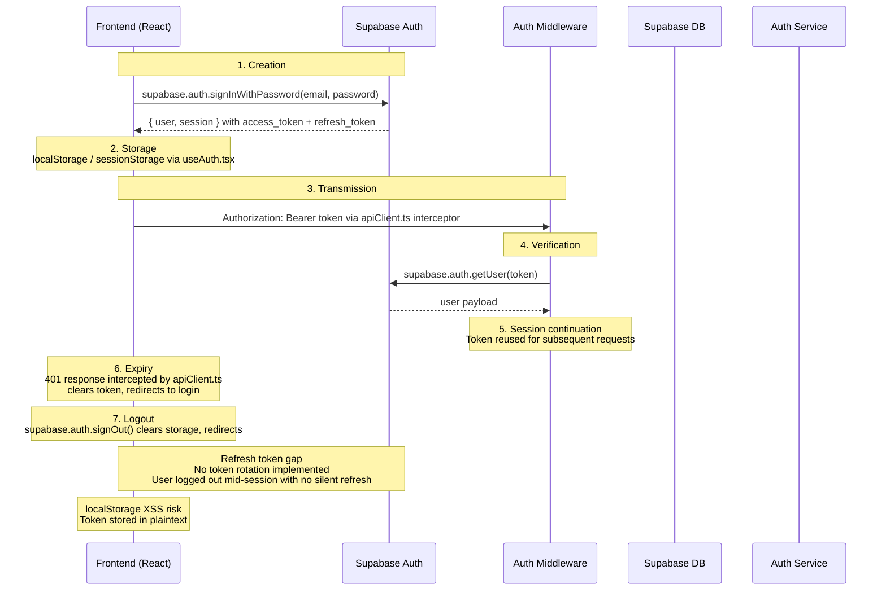

## B-03: Auth Token Lifecycle

Shows the full JWT token lifecycle in the PoDM platform from creation through storage, transmission, verification, expiry handling, and logout.

Traces the 7 lifecycle stages: creation via Supabase Auth sign-in, client-side storage, API transmission, middleware verification, session continuation, 401-based expiry handling, and logout cleanup. Annotations highlight the missing refresh token rotation and plaintext localStorage XSS vulnerability.
