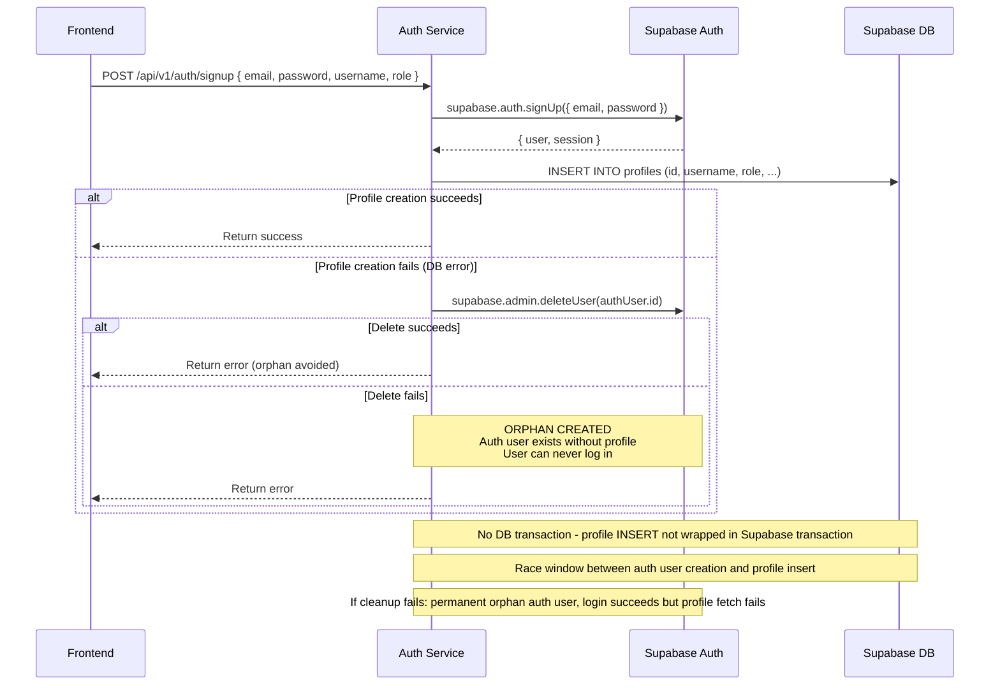

## B-05: Auth Orphan Cleanup Flow

Shows the signup flow with the fragile orphan cleanup mechanism when profile creation fails after auth user creation, leading to permanent orphan states.

Traces the signup flow through auth service, Supabase Auth user creation, and profile table insert. Annotations highlight the missing DB transaction, race window exposure, and irreversible orphan state when cleanup fails.
