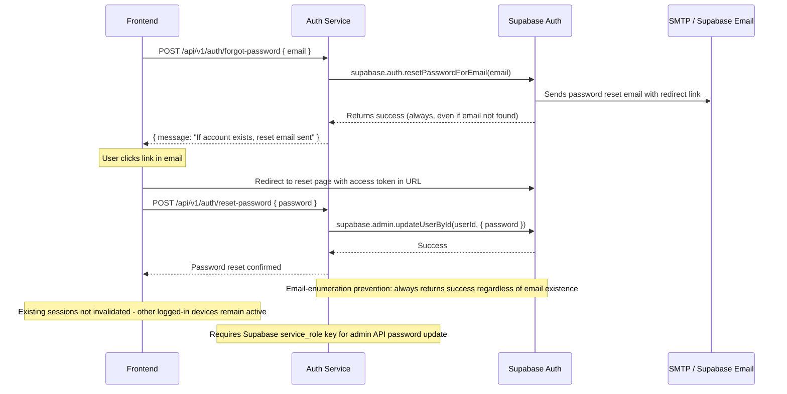

## B-06: Password Reset Flow

Shows the forgot password and password reset flow with email-enumeration prevention, redirect-based token delivery, and admin API password update.

Covers the forgot-password request, email sending via Supabase, always-success response for enumeration prevention, the redirect with access token, and the admin-API password update. Annotations note the lack of session invalidation and the service_role key requirement.
