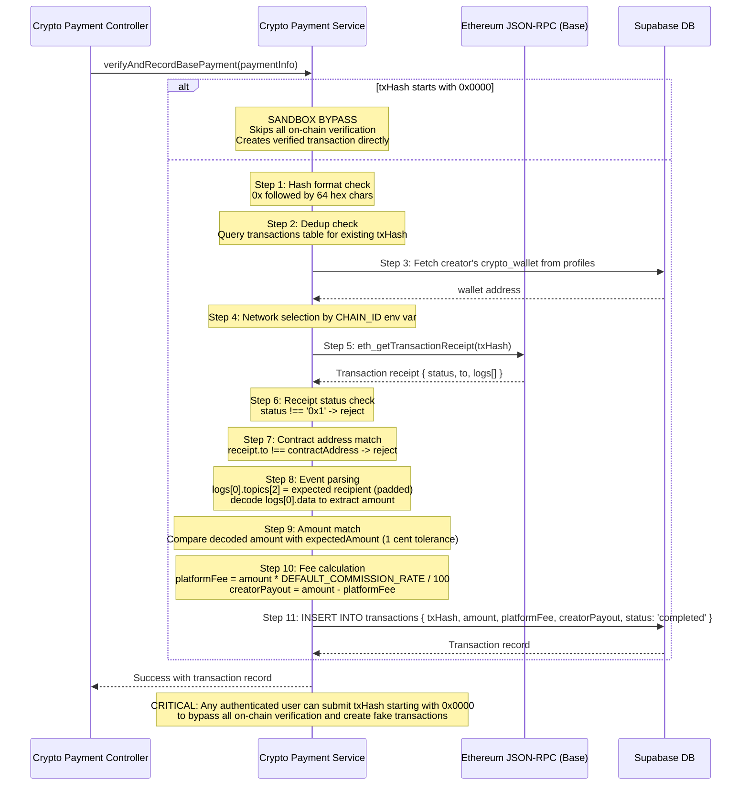

## C-02: Crypto Verification Sequence (11-Step)

Details the 11-step verifyAndRecordBasePayment flow for on-chain crypto payment verification on the Base network, including the critical sandbox bypass vulnerability.

Shows the full verification pipeline from initial call through hash validation, dedup check, RPC receipt verification, event parsing, fee calculation, and DB recording. Annotations highlight the critical sandbox bypass where `0x0000`-prefixed hashes skip all on-chain checks.
