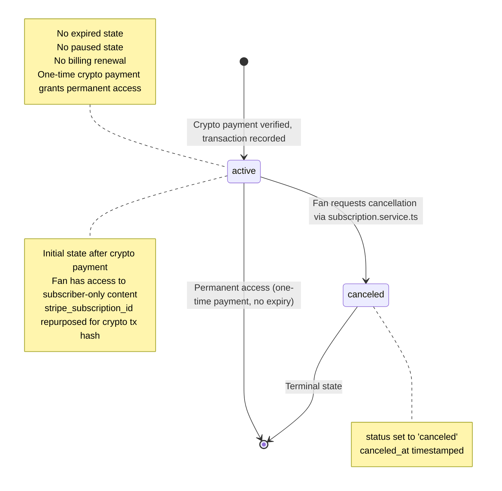

## C-03: Subscription State Diagram

Shows the subscription lifecycle with its minimal state machine -- only two states exist with no expiry, pause, or renewal mechanisms.

Only two states exist (active and canceled) with no expired, paused, or renewal states. Subscriptions are permanent one-time crypto payments -- the `stripe_subscription_id` column is repurposed to store the crypto transaction hash.
