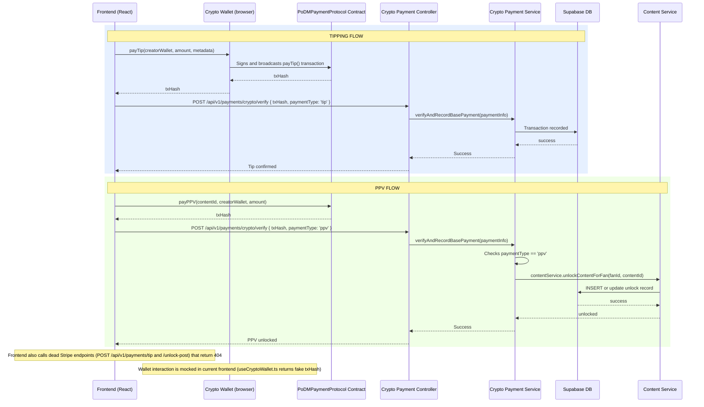

## C-04: Tipping and PPV Payment Flow

Shows the tipping and pay-per-view (PPV) unlock flows using crypto payments via the PoDMPaymentProtocol smart contract.

Shows both the tipping flow (wallet transaction to smart contract, verification, confirmation) and the PPV flow (with additional content unlock step). Annotations note the dead Stripe endpoints and the mocked wallet interaction.
