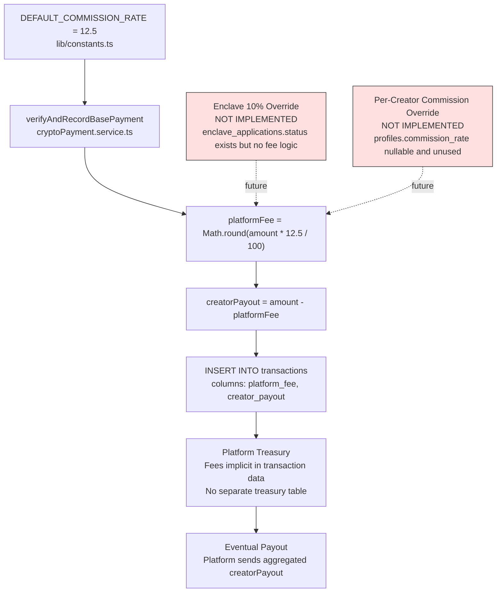

## C-06: Platform Fee Calculation Flow

Shows how the 12.5% platform fee flows from the hardcoded constant through per-transaction calculation, DB recording, treasury accumulation, and eventual payout.

Traces the fee lifecycle from the hardcoded 12.5% constant through per-transaction calculation, DB insert, platform treasury (implicit), and eventual aggregated payout. Annotations highlight the unimplemented enclave 10% override and the unused per-creator `commission_rate` column.
