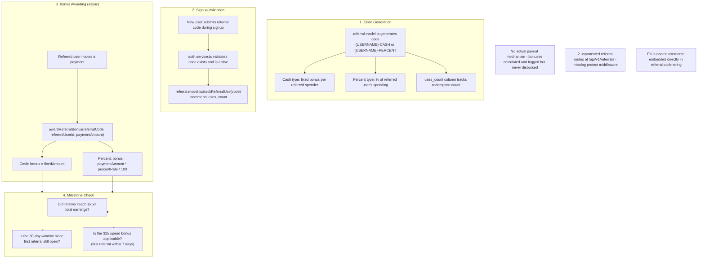

## C-07: Referral Bonus Awarding Flow

Shows the full referral bonus lifecycle from code generation through signup validation, bonus awarding, and milestone checks.

Covers the 4 stages: code generation with cash/percent types and usage tracking, signup validation, async bonus awarding when referred users pay, and milestone checks for earnings thresholds and speed bonuses. Annotations highlight the missing payout mechanism, unprotected routes, and embedded PII.
