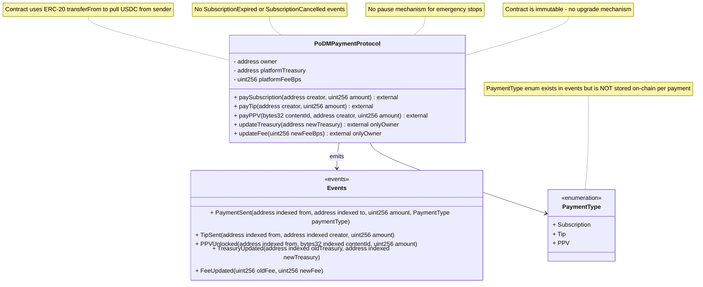

## C-08: Smart Contract Structure (PoDMPaymentProtocol)

Shows the structure of the PoDMPaymentProtocol Solidity smart contract including properties, external functions, events, the PaymentType enum, and their relationships.

Diagrams the contract's storage properties (owner, treasury, fee), 5 external functions (paySubscription, payTip, payPPV, updateTreasury, updateFee), 5 events, and the PaymentType enum. Annotations highlight the lack of on-chain PaymentType storage, missing lifecycle events, absent pause mechanism, and immutability.
