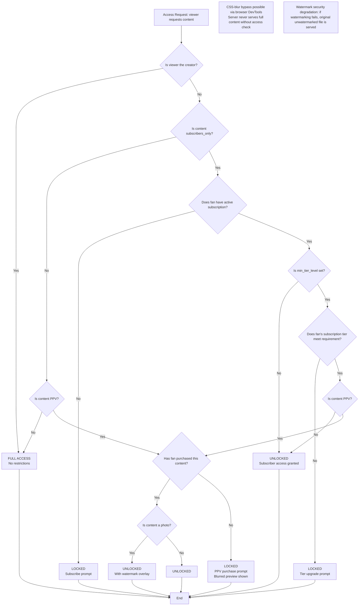

## D-02: Content Access Control Decision Tree

Shows the content access decision pipeline in content.service.ts (lines 461-502) as a 9-decision-node flowchart from initial request through subscription, tier, PPV, and watermark checks.

Traces the 9 decision nodes: creator check (bypass all), subscribers_only flag, subscription validity, min_tier_level requirement, PPV flag, transaction-based purchase check, and watermark overlay for photos. Annotations highlight the CSS-blur bypass risk and watermark security degradation fallback.
