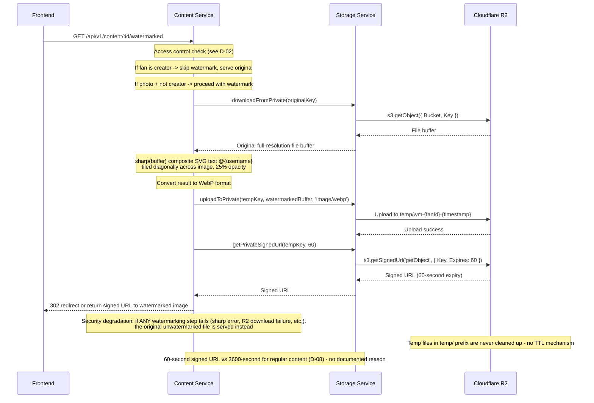

## D-04: Dynamic Watermarking Sequence

Shows the on-the-fly dynamic watermarking flow for photo content using sharp to composite a tiled @username SVG watermark, with temp upload and 60-second signed URL delivery.

Traces the watermark pipeline: access control check, original download from private R2, sharp-based SVG watermark composition (tiled @username at 25% opacity), temp upload, 60-second signed URL generation, and delivery. Annotations highlight the security degradation fallback and uncleaned temp files.
