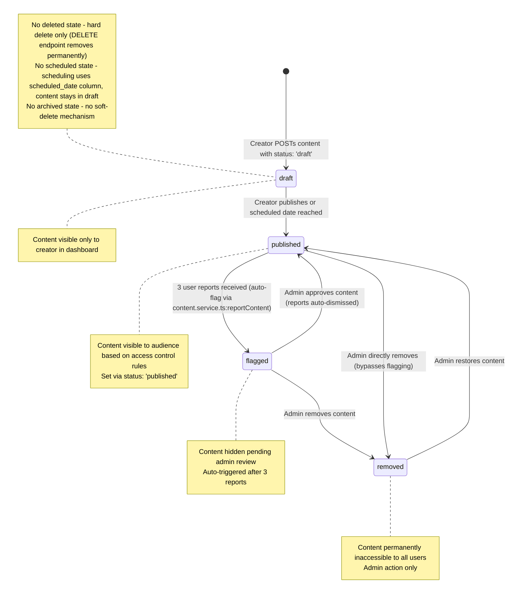

## D-06: Content Lifecycle State Diagram

Shows the content lifecycle with 4 states (draft, published, flagged, removed) and all transitions including auto-flagging on 3 reports and admin bypass paths.

Shows the 4 content states and 7 transitions including creator actions (publish), automatic flagging (3 reports), admin actions (approve, remove, restore), and the direct admin removal bypass. Annotations note the missing deleted, scheduled, and archived states.
