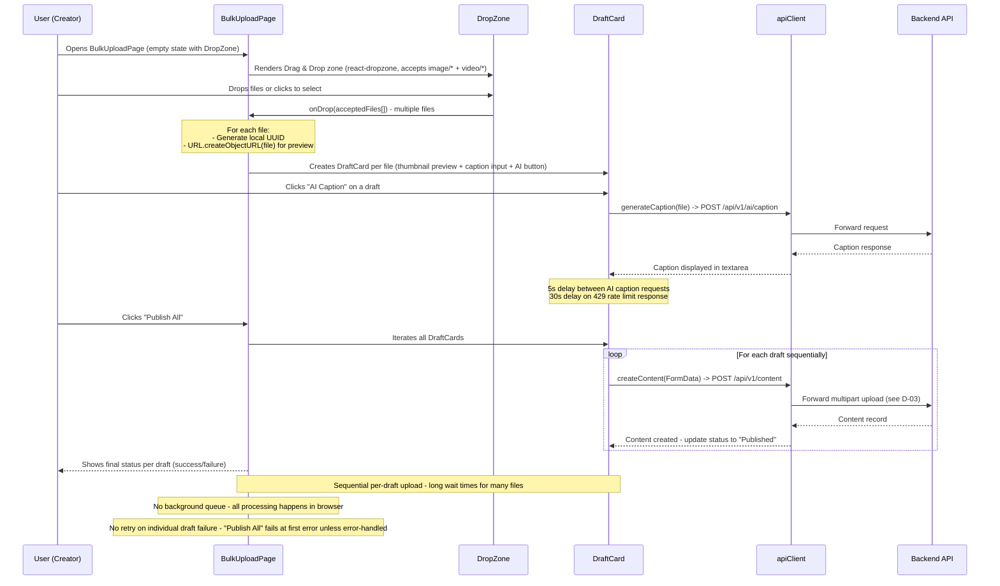

## D-07: Bulk Upload Pipeline

Shows the reusable bulk upload flow from the Drag & Drop zone through individual DraftCards with AI captioning to sequential publish-all.

Traces the full user journey: DropZone file selection, per-file DraftCard creation, optional AI caption generation, and sequential "Publish All" execution. Annotations highlight the sequential upload bottleneck, lack of background queue, and single-failure vulnerability.
