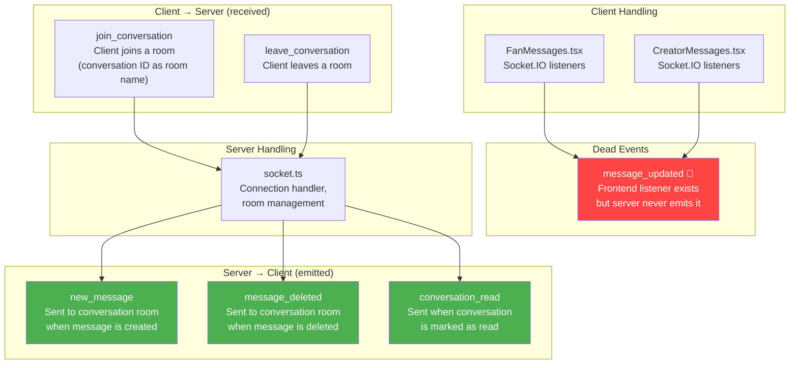

## E-02: WebSocket Event Catalog

A catalog of all Socket.IO events in the system, organized by direction and annotated with dead/ missing events.

The catalog reveals three issues: `message_updated` is registered on the frontend but never emitted by the server (🔴), typing indicators (`typing`/`stop_typing`) do not exist (🟡), and offline delivery is not supported — messages are loaded on next page load via REST (🟡).
