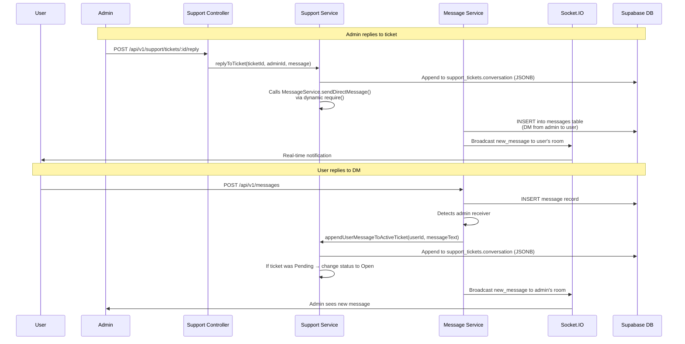

## E-03: Support Ticket ↔ DM Sync Sequence

Cross-service synchronization between support tickets and direct messages, including the dynamic `require()` circular dependency.

Three issues are flagged: 🔴 **Dynamic `require()`** at `support.service.ts:71` instead of a static import can cause circular dependency or runtime failure; 🟡 the JSONB conversation array lacks a relational model (no separate `support_messages` table); 🟡 email notifications are not sent when a ticket is replied to despite SMTP being configured.
