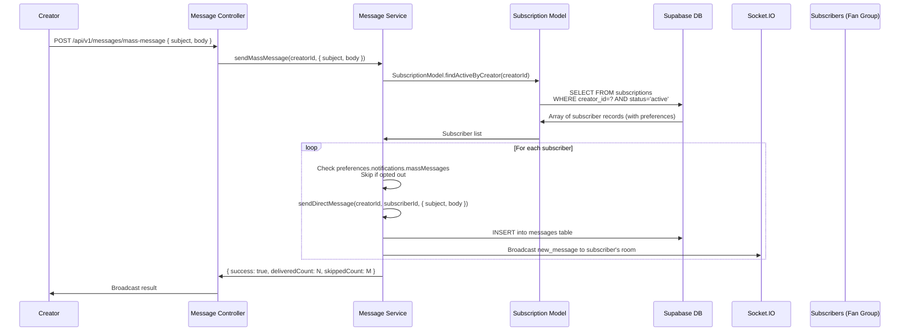

## E-04: Creator Broadcast Message Delivery

Sequence diagram for creator broadcast (mass message) delivery to all active subscribers.

Three issues are flagged: 🔴 **N+1 query pattern** — one query fetches subscribers then N individual `sendDirectMessage` calls; 🟡 **Fire-and-forget** — no retry on individual message failure; 🟡 **No rate limiting** — creator could send unlimited broadcasts.
