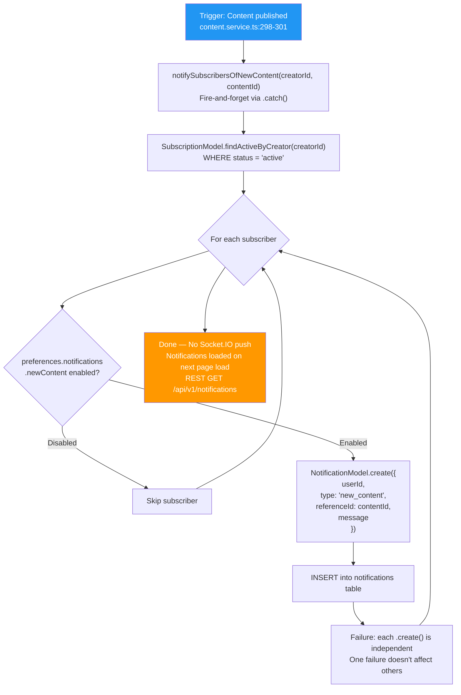

## E-05: Subscriber Notification Delivery Flow

Flowchart showing how new content notifications are delivered to subscribers, with fire-and-forget semantics.

Three issues are flagged: 🔴 **No real-time delivery** — notifications are persisted to DB but never pushed via Socket.IO; 🟡 **Fire-and-forget** — the entire method is `.catch()`'d, silently swallowing errors; 🟡 **Per-notification failure isolation** is good — one subscriber failure does not cascade.
