## F-02: Data Flow Layer Architecture

Cross-cutting 10-step data lifecycle shared across all 14 features, with deviations annotated per stage.

```mermaid
flowchart TD
    subgraph Pipeline["10-Stage Data Lifecycle Pipeline"]
        direction TB
        S01["1. Origin<br/>Where data enters<br/>Standard: REST POST body → controller<br/>Deviations: R2 upload (Multer),<br/>Socket.IO (event), cron (internal)"]
        S02["2. Validation<br/>Standard: Zod schema / manual checks<br/>Deviations: Multer MIME filter (content),<br/>Supabase Auth (login)"]
        S03["3. Transformation<br/>Standard: Controller reshapes request body<br/>Deviations: reshapeUserForApp (auth),<br/>sharp/ffmpeg (content), fee calc (payments)"]
        S04["4. Storage<br/>Standard: Model.create() → INSERT<br/>Deviations: R2 s3.putObject (content),<br/>JSONB append (support tickets)"]
        S05["5. Caching<br/>No caching anywhere —<br/>all features fall through"]
        S06["6. Retrieval<br/>Standard: Model.findById() → response<br/>Deviations: Signed URLs (content),<br/>aggregation queries (analytics/admin)"]
        S07["7. Modification<br/>Standard: Model.update() → SET<br/>Deviations: JSONB append (support),<br/>R2 delete+re-upload (content)"]
        S08["8. Deletion<br/>Standard: Model.delete() → hard delete<br/>Deviations: R2 cleanup cascade (content),<br/>auth user+profile cleanup (signup orphan)"]
        S09["9. Synchronization<br/>Standard: none<br/>Deviations: Ticket↔DM sync,<br/>notification after publish,<br/>payout after earnings agg"]
        S10["10. External Transmission<br/>Standard: Response JSON to client<br/>Deviations: Socket.IO broadcast,<br/>R2 upload, Stripe API,<br/>OpenAI API, Ethereum RPC"]
    end

    S01 --> S02 --> S03 --> S04 --> S05 --> S06 --> S07 --> S08 --> S09 --> S10

    style S05 fill:#ff9800,color:#fff
```

The pipeline highlights that caching (stage 5) is entirely absent across all features (🟡), and synchronization (stage 9) is the least standardized — only support ticket ↔ DM sync, notification after publish, and payout after earnings aggregation implement it.
