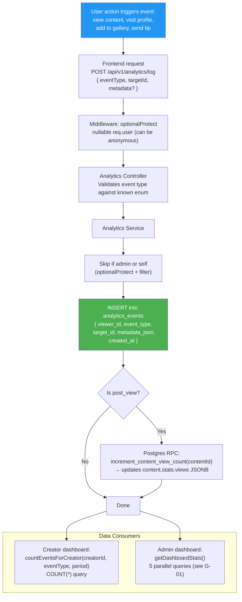

## F-03: Analytics Pipeline

The analytics event lifecycle from user action to data consumption, highlighting scalability gaps.

Three issues are flagged: 🔴 **No data aggregation/caching** — every dashboard load runs raw `COUNT(*)` on the full table; 🔴 **Unbounded table growth** — `analytics_events` has no TTL, archive, or deletion policy; 🟡 **Guest tracking** works with nullable `viewer_id` but no privacy consideration is documented.
