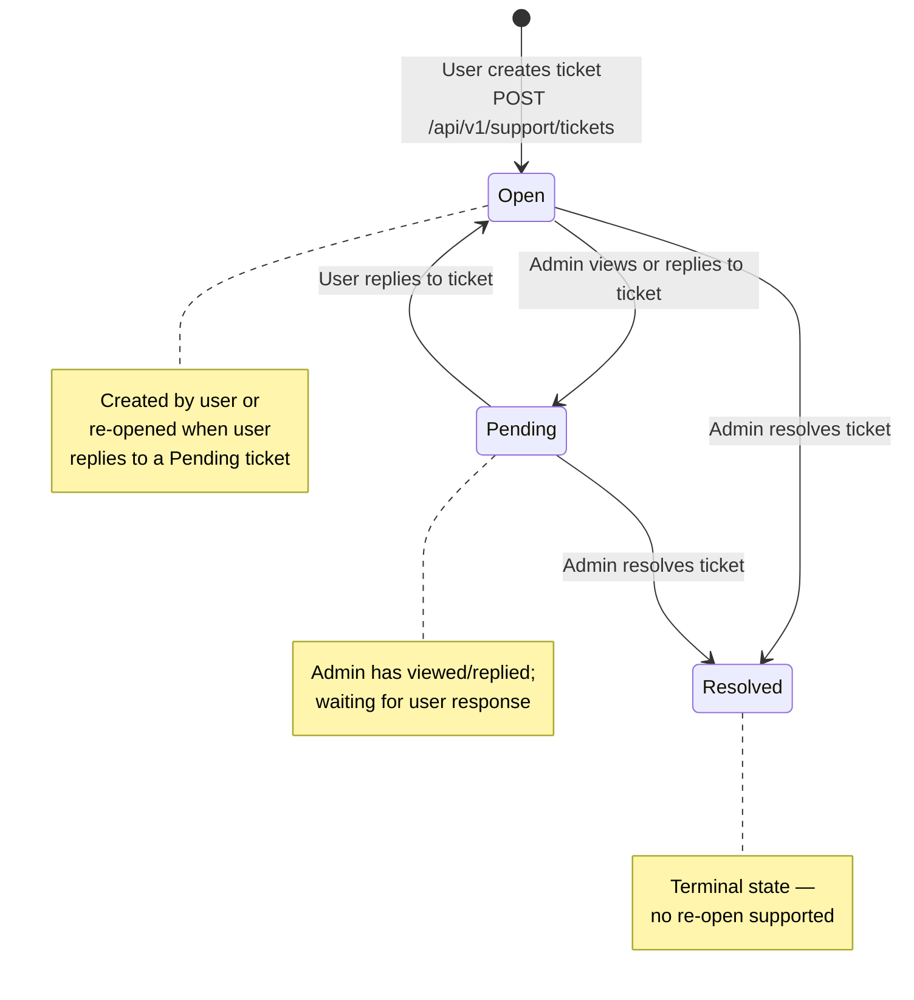

## F-04: Support Ticket State Diagram

State diagram for the support ticket lifecycle with three states and implicit transitions in service methods.

Three gaps are noted: ⚠️ **No `Closed` state** — only `Resolved` exists; ⚠️ **No re-open from `Resolved`** — once resolved the ticket is terminal; ⚠️ State transitions are implicit in service methods and not enforced at the DB level (no CHECK constraint on status).
