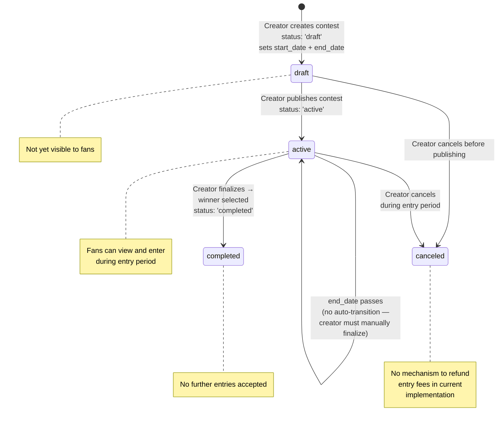

## F-05: Contest Lifecycle State Diagram

State diagram for the contest lifecycle from draft through active, completed, or canceled.

Two gaps are flagged: ⚠️ **No auto-complete** — when `end_date` passes the contest stays `active` and the creator must manually finalize; ⚠️ **No `canceled` entry refund** — if canceled during the active period, there is no mechanism to refund entry fees (entries are free with subscription check in the current implementation).
