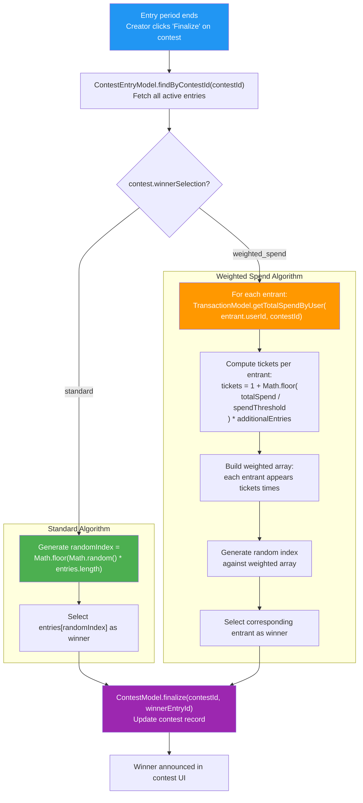

## F-06: Contest Winner Selection Flow

Flowchart showing the two winner selection algorithms (standard and weighted spend) and their shared finalization step.

Three issues are flagged: 🔴 **Not cryptographically secure** — `Math.random()` is used for winner selection without verifiable randomness; 🔴 **No audit trail** — there is no record of the random seed, algorithm inputs, or selected winner's probability; 🟡 **Weighted algorithm queries `transactions` table** with real dollar amounts, raising privacy concerns for entrants.
