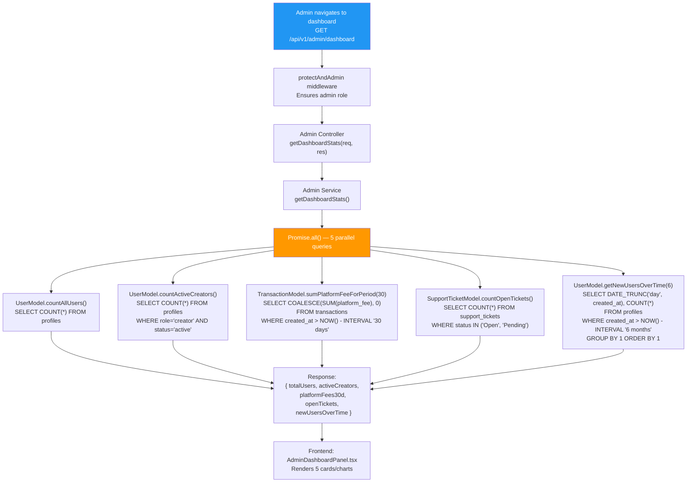

## G-01: Admin Dashboard Data Flow

Flowchart showing how the admin dashboard aggregates data from 5 parallel queries with `Promise.all()`.

Three issues are flagged: 🟡 **No caching** — every dashboard page load runs 5 queries against potentially large tables; 🟡 **No error isolation** — if one query fails the entire `Promise.all` rejects and the dashboard shows an error; 🟡 **`sumPlatformFeeForPeriod` scans the transactions table** with no index on `created_at` with a partial `platform_fee IS NOT NULL`.
