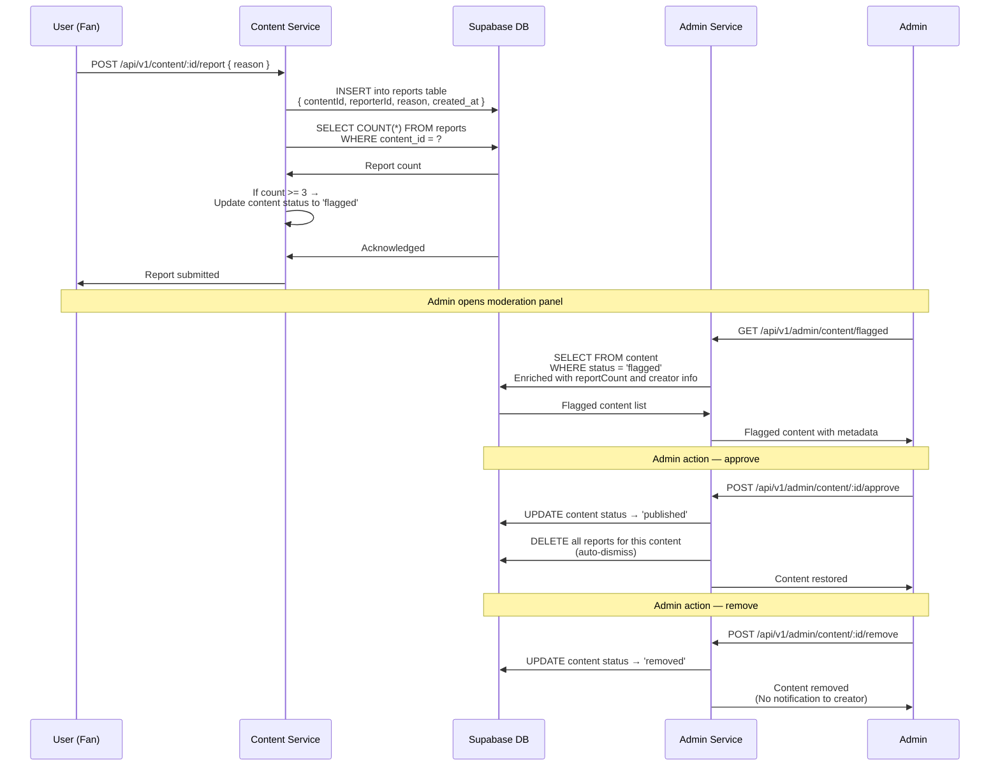

## G-02: Admin Moderation Workflow

Sequence diagram for content moderation from user report through admin action (approve or remove).

Three issues are flagged: 🟡 **No creator notification** — creator is not notified when their content is flagged or removed; 🟡 **Auto-dismiss on approve** — all reports are deleted so there is no audit trail of past reports; 🔴 **No appeal mechanism** — the creator cannot appeal a removal decision.
