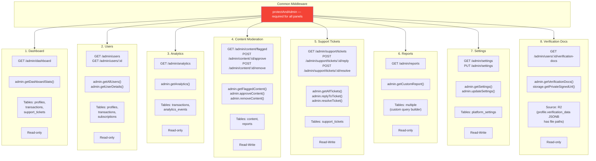

## G-03: Admin Panel Structure & Data Sources

Mapping of all 8 admin panels to their backend routes, services, models, and DB tables.

All panels require the `protectAndAdmin` middleware. 🔴 **No admin audit trail** — there is no `admin_action_log` table recording admin operations.
