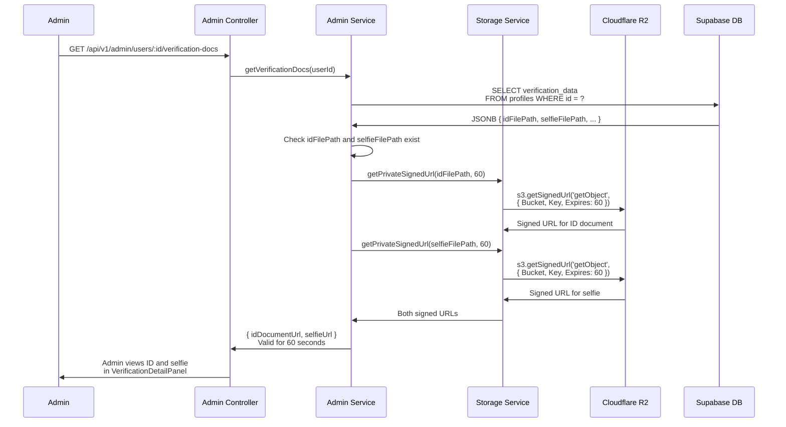

## G-04: Verification Document Access Flow

Sequence diagram for admin access to creator verification documents via Cloudflare R2 signed URLs.

Three issues are flagged: 🔴 **PII sensitivity** — ID documents contain full name, date of birth, address, and ID number transmitted via temporary URL; 🟡 **60-second window** — URLs expire quickly but are logged in browser history / network tab; 🟡 **No access audit** — no record of who viewed whose verification docs or when.
