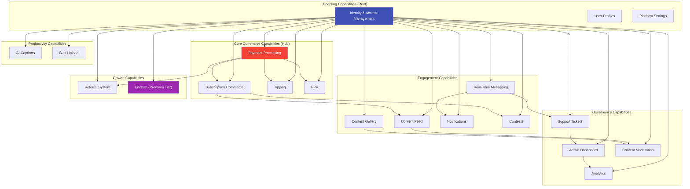

## H-02: Business Capability Dependency Graph

Dependency graph among all 20 business capabilities, organized into color-coded layers.

**Payment Processing** is the most depended-on capability (5 dependents). **Content Feed** and **Content Gallery** share an identical data source (Content service). **Enclave** is the most isolated — it depends only on IAM.
