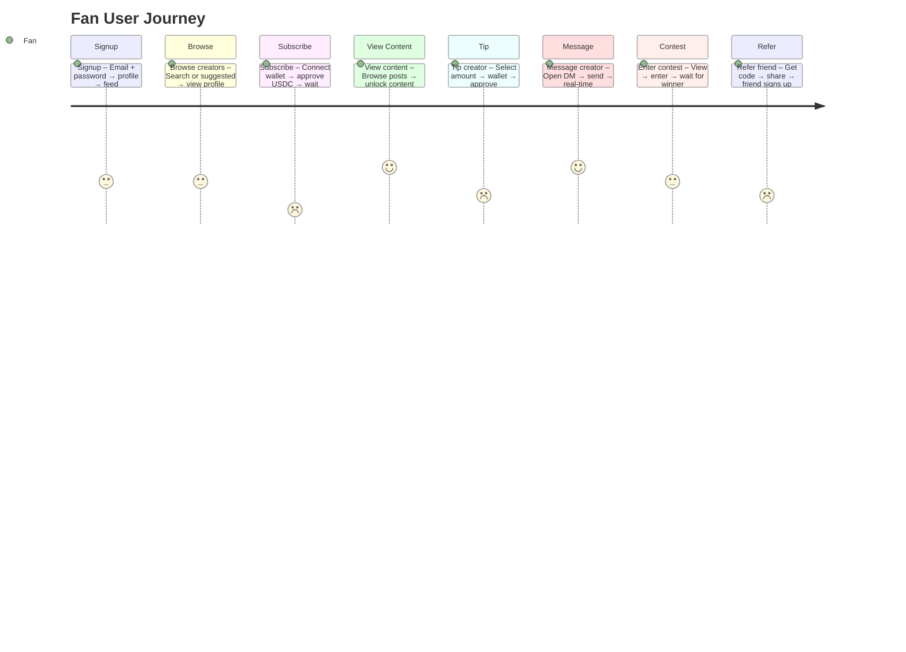

## H-03: User Journey Map (Fan)

Journey diagram showing the fan's experience through 8 key milestones with emotional scoring and friction annotations.

Key friction points: 🔴 **Subscribe** — mocked wallet returns fake txHash, real crypto wallet not integrated; 🔴 **Tip** — dead Stripe endpoints 404, crypto flow is mocked; 🔴 **Refer** — referral bonuses calculated but never paid out; 🟡 **View Content** — watermarking adds load delay, CSS blur is easy to bypass; 🟡 **Message** — no typing indicators, no offline delivery; 🟡 **Contest** — no visibility into winner selection, no audit trail.
