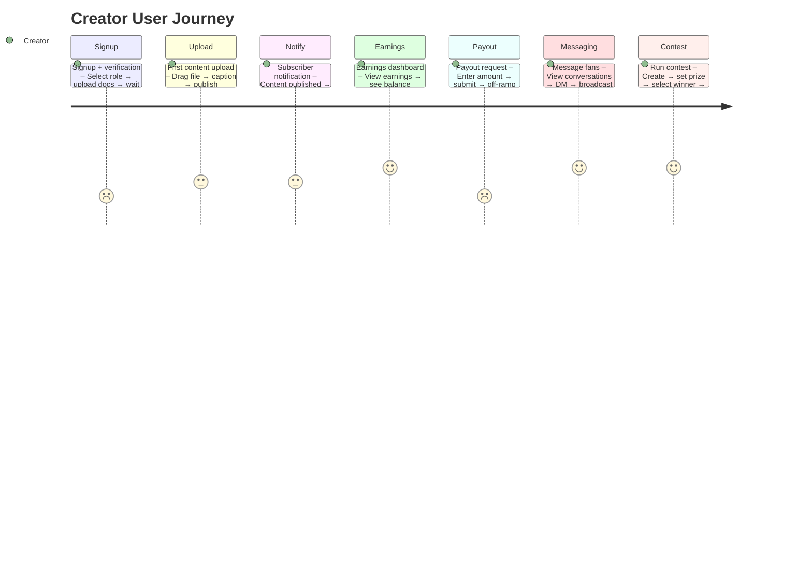

## H-04: User Journey Map (Creator)

Journey diagram showing the creator's experience through 7 key milestones with emotional scoring and friction annotations.

Key friction points: 🔴 **Payout** — off-ramp is fully mocked, no real money received; 🟡 **Signup** — verification process is manual with no status updates; 🟡 **Upload** — synchronous thumbnail generation slows upload, 1GB memory buffer per file; 🟡 **Notify** — no real-time push to subscribers (see E-05); 🟡 **Messaging** — broadcast has N+1 query pattern (see E-04); 🟡 **Contest** — `Math.random()` winner selection with no verifiable fairness.
