## H-05: Role-Based Access Boundaries

Four concentric role boundaries showing what each role can access, with security gaps annotated.

```mermaid
flowchart TD
    subgraph Unauthenticated["Unauthenticated (Outer)"]
        U1["Auth routes: login, signup, forgot-password"]
        U2["Public content (visible in feed/gallery before login)"]
        U3["Analytics logging (optionalProtect)"]
    end

    subgraph Fan["Fan Role"]
        F1["All auth routes"]
        F2["Browse/search creators"]
        F3["View creator profiles"]
        F4["Subscribe (crypto payment)"]
        F5["View subscriber content (if subscribed)"]
        F6["Purchase PPV content"]
        F7["Send tips"]
        F8["Message subscribed creators"]
        F9["Enter contests (if subscribed)"]
        F10["Refer friends"]
        F11["Report content"]
        F12["Create support tickets"]
    end

    subgraph Creator["Creator Role"]
        C1["All fan capabilities"]
        C2["Upload content (single + bulk)"]
        C3["AI caption generation"]
        C4["View earnings dashboard"]
        C5["Request payouts"]
        C6["Manage content (edit, delete, schedule)"]
        C7["Send broadcast messages"]
        C8["Run contests"]
        C9["View subscriber analytics"]
        C10["Manage subscription tiers"]
        C11["Create referral codes"]
        C12["Apply to Enclave"]
    end

    subgraph Admin["Admin Role (Innermost)"]
        A1["All capabilities (full system access)"]
        A2["Impersonate any user<br/>(X-Impersonating-User-Id header)"]
        A3["Dashboard (5 parallel queries)"]
        A4["User management"]
        A5["Content moderation (flag, approve, remove)"]
        A6["Support ticket management"]
        A7["Platform settings"]
        A8["View verification documents"]
        A9["Custom reports"]
    end

    Unauthenticated --> Fan
    Fan --> Creator
    Creator --> Admin

    style Unauthenticated fill:#e0e0e0
    style Fan fill:#bbdefb
    style Creator fill:#c8e6c9
    style Admin fill:#ffcdd2
```

Security gaps: 🔴 **No fan route guard** — frontend `/fan/*` routes lack `withAuthGuard`, accessible to unauthenticated users (UI leaks); 🔴 **2 unprotected referral routes** — `/api/v1/referrals/*` has no `protect` middleware on the backend; 🔴 **Impersonation boundary bypass** — admin can impersonate any user with no audit trail of impersonation actions.
