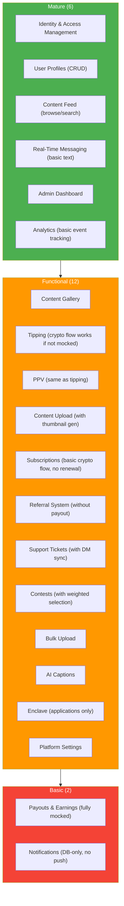

## H-06: Feature Maturity Radar

Classification of all 20 business capabilities into three maturity tiers: Mature (6), Functional (12), and Basic (2).

The gap between Mature and Basic tiers highlights where investment is needed: **Payouts & Earnings** is fully mocked (no real money flows), and **Notifications** has no push delivery — it is DB-only with no real-time capability.
