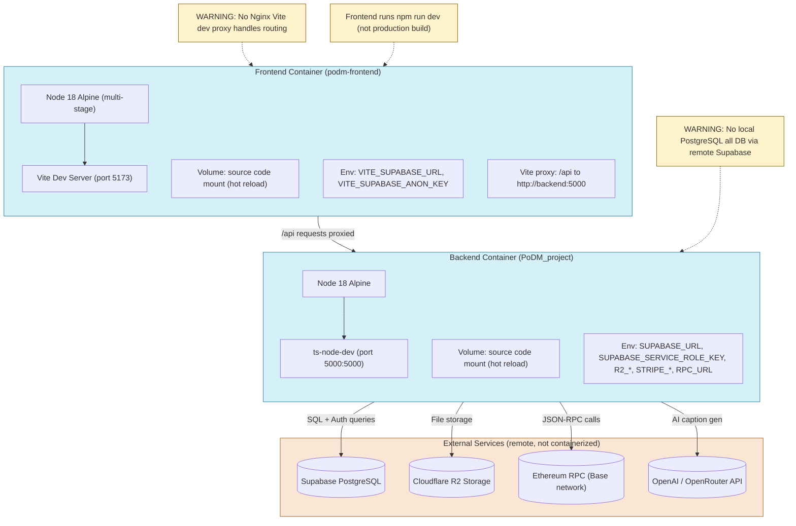

## Docker Local Development Architecture

**Diagram ID:** I-02

This diagram illustrates the local development environment started via `docker-compose up`, showing the frontend and backend containers, their configurations, and the external cloud services they connect to.

The diagram highlights that this is a cloud-dependent development setup with no local PostgreSQL or Nginx. The frontend container runs Vite in development mode, proxying API requests directly to the backend container. Both containers mount source code for hot reload, and all persistent services (database, storage, blockchain, AI) are accessed remotely.
