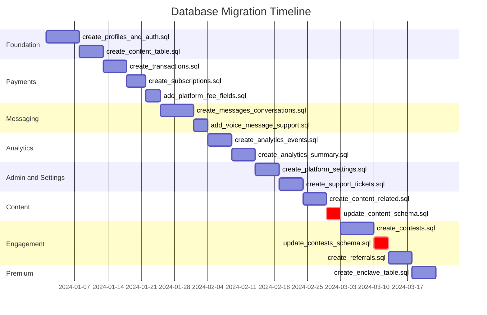

## Database Migration Timeline

**Diagram ID:** I-03

This Gantt chart presents the chronological sequence of over 15 SQL migrations run against the Supabase PostgreSQL database, grouped by feature area. Post-launch patches are distinguished from original migrations.

The migrations are ordered chronologically within each feature area. The `update_content_schema.sql` and `update_contests_schema.sql` (marked with `crit`) are post-launch patches. The smallest migrations are `add_voice_message_support.sql` and the two schema patches.
