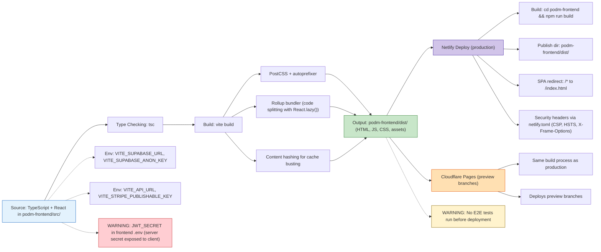

## Build and Deploy Pipeline (Frontend)

**Diagram ID:** I-04

This flowchart traces the frontend build pipeline from TypeScript source through type checking, bundling, and deployment to both production (Netlify) and preview (Cloudflare Pages) environments.

The build pipeline runs TypeScript type checking followed by Vite bundling with PostCSS and Rollup. Output lands in `dist/` and is deployed to either Netlify (production, with SPA redirects and security headers) or Cloudflare Pages (preview branches). Notable issues include `JWT_SECRET` exposed in the frontend bundle and the absence of E2E tests before deployment.
