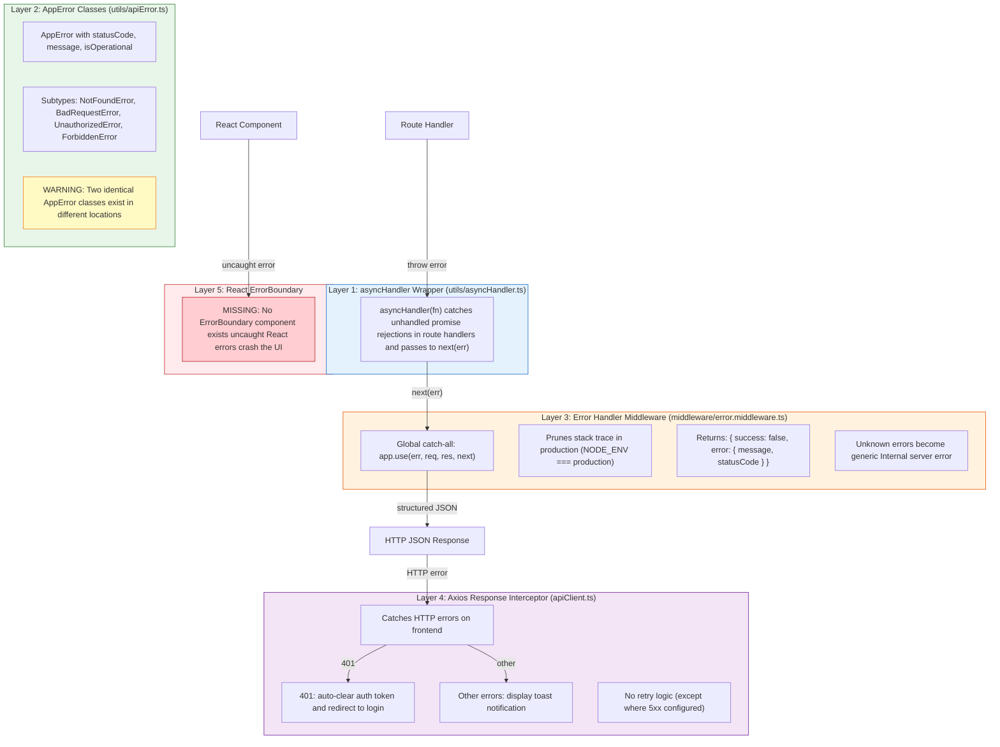

## Error Handling Layer Architecture

**Diagram ID:** J-01

This flowchart shows the five-layer error handling pipeline spanning backend and frontend, from async route handler wrapping to React component error boundaries.

Error propagation: backend route handlers throw errors caught by `asyncHandler`, which passes them to `next(err)`. The global error middleware returns structured JSON. On the frontend, the Axios interceptor catches HTTP errors to show toasts or redirect on 401. The critical gap is the missing React ErrorBoundary, meaning any uncaught render error crashes the UI entirely.
