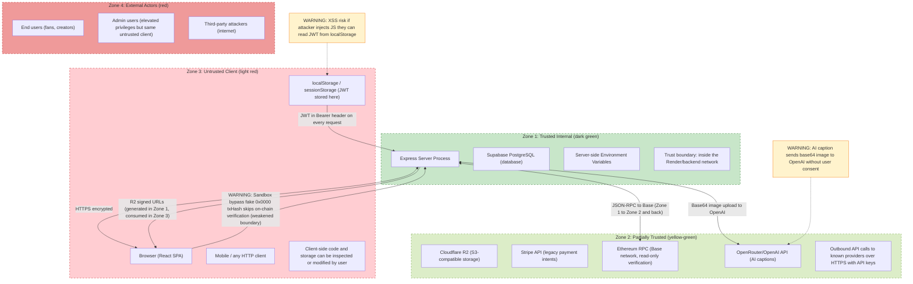

## Security Boundary and Trust Diagram

**Diagram ID:** J-02

This flowchart defines four concentric trust zones from the trusted internal server network to external untrusted actors and maps data flows across each boundary, highlighting risks including XSS, JWT storage, and the sandbox bypass vulnerability.

The four trust zones progress from Trusted Internal (Express server, database, env vars) through Partially Trusted (R2, Stripe, Ethereum, AI APIs) and Untrusted Client (browser, localStorage) to External Actors. Key risk vectors include JWTs in localStorage susceptible to XSS, R2 signed URLs crossing trust boundaries, and the sandbox bypass where a fake transaction hash from an untrusted client skips on-chain verification in the trusted zone.
