## Sensitive Data Flow Map

**Diagram ID:** J-03

This flowchart traces five categories of sensitive data (PII, secrets, auth tokens, payment data, AI data) across entry points, storage locations, and transmission channels, highlighting security and privacy risks.

```mermaid
flowchart TB
    subgraph PII["PII (Personally Identifiable Information)"]
        direction TB
        PII_ENTRY["Entry: signup form (email, username, name), verification upload (ID, selfie), support tickets"]
        PII_STORE["Storage: profiles table (email, username, verification JSONB with file paths), support_tickets.conversation JSONB"]
        PII_TX["Transmission: 60s signed URLs via R2, email via SMTP (unused), auth debug log to disk"]
        PII_DEBUG["WARNING: auth.middleware.ts writes PII via appendFileSync(debug.log) - 27K+ lines"]
        PII_ENTRY --> PII_STORE --> PII_TX
        PII_DEBUG -.-> PII_STORE
    end

    subgraph SEC["Secrets / Credentials"]
        direction TB
        SEC_ENTRY["Entry: Environment variables, .env files"]
        SEC_STORE["Storage: 3 .env copies (root, backend, frontend), Render/Netlify environment config"]
        SEC_TX["Transmission: accessible in frontend bundle if VITE_-prefixed"]
        SEC_JWT["WARNING: JWT_SECRET in frontend .env (server secret exposed to client bundle)"]
        SEC_SUPA["WARNING: SUPABASE_SERVICE_ROLE_KEY in frontend .env (full DB access key in client code)"]
        SEC_ENTRY --> SEC_STORE --> SEC_TX
        SEC_JWT -.-> SEC_TX
        SEC_SUPA -.-> SEC_TX
    end

    subgraph AUTH["Auth Data (Tokens)"]
        direction TB
        AUTH_ENTRY["Entry: Supabase Auth response (JWT)"]
        AUTH_STORE["Storage: localStorage or sessionStorage"]
        AUTH_TX["Transmission: Bearer header on every request"]
        AUTH_XSS["WARNING: localStorage XSS vector any XSS vulnerability leaks all JWTs"]
        AUTH_ENTRY --> AUTH_STORE --> AUTH_TX
        AUTH_XSS -.-> AUTH_STORE
    end

    subgraph PAY["Payment Data"]
        direction TB
        PAY_ENTRY["Entry: crypto wallet address (profiles.crypto_wallet), transaction hashes, USDC amounts"]
        PAY_STORE["Storage: transactions table, subscriptions table (txHash in stripe_subscription_id)"]
        PAY_TX["Transmission: Ethereum RPC (txHash, contract address)"]
        PAY_SAFE["OK: No raw card data stored (Stripe Elements tokenizes on frontend)"]
        PAY_ENTRY --> PAY_STORE --> PAY_TX
        PAY_SAFE -.-> PAY_STORE
    end

    subgraph AI["AI Data (Prompts/Responses)"]
        direction TB
        AI_ENTRY["Entry: image upload for caption generation"]
        AI_STORE["Storage: content.description (caption result)"]
        AI_TX["Transmission: Base64-encoded image sent to OpenRouter/OpenAI"]
        AI_WARN["WARNING: No user consent media sent to third-party AI API without explicit disclosure"]
        AI_ENTRY --> AI_STORE --> AI_TX
        AI_WARN -.-> AI_TX
    end

    style PII fill:#fbe9e7,stroke:#d84315
    style SEC fill:#ffebee,stroke:#c62828
    style AUTH fill:#fff8e1,stroke:#f9a825
    style PAY fill:#e8f5e9,stroke:#2e7d32
    style AI fill:#f3e5f5,stroke:#6a1b9a
```

Five sensitive data categories are traced: PII (entered via forms, stored in profiles tables, and leaked to disk-based debug logs via `appendFileSync`), Secrets/Credentials (proliferated across multiple `.env` copies, with `JWT_SECRET` and `SUPABASE_SERVICE_ROLE_KEY` exposed to the frontend bundle), Auth Tokens (JWTs in localStorage vulnerable to XSS), Payment Data (crypto addresses and txHashes stored on-chain-adjacent, but no raw card data), and AI Data (images sent to third-party APIs without user consent).
