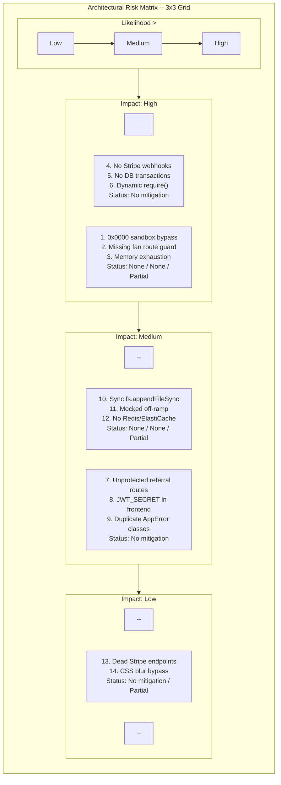

## J-04: Architectural Risk Matrix

Architectural risk matrix mapping 14 identified security and operational risks across a 3×3 Impact × Likelihood grid, annotated with mitigation status and source file paths.

Matrix places each risk in one of nine cells by Impact (rows) and Likelihood (columns). Critical zone (High × High) contains the `0x0000` sandbox bypass, missing fan route guard, and memory exhaustion. High zone (High × Medium and Medium × High) contains six risks across payment drift, DB partial failures, dynamic require, unprotected routes, exposed secrets, and duplicate error classes. Medium and Low zones contain the remaining five items. No risks appear in Low × Low or Low × High cells.
