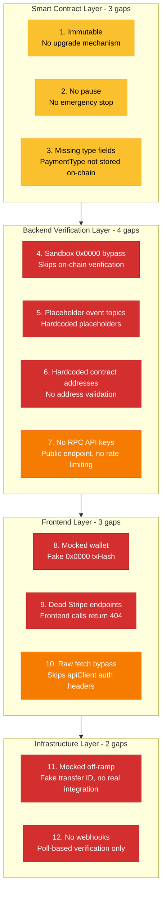

## J-05: Crypto Security Gap Heatmap

Crypto security gap heatmap grouping 12 identified gaps across four architectural layers with severity color coding.

Twelve crypto security gaps organized by layer: Smart Contract (3 medium), Backend Verification (4 — 3 critical, 1 high), Frontend (3 — 2 critical, 1 high), Infrastructure (2 critical). Critical gaps include the `0x0000` sandbox bypass, placeholder event topics, hardcoded addresses, mocked wallet, dead Stripe endpoints, mocked off-ramp, and missing webhooks.
